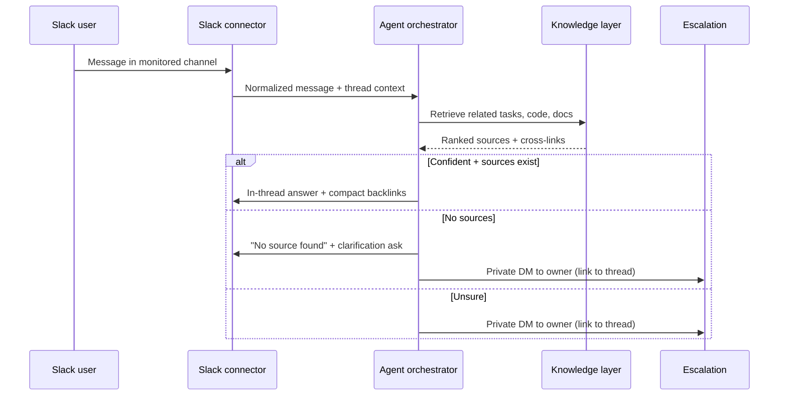
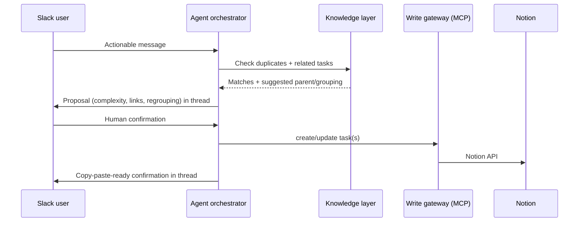
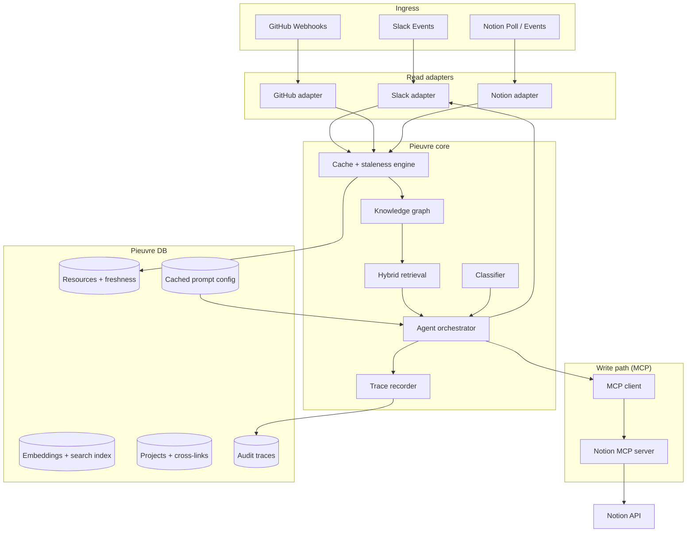

# Pieuvre

**Knowledge center for projects.** Pieuvre monitors Slack, reads GitHub and Notion, cross-links related work, answers questions with exact source citations, and proposes well-linked Notion tasks — with human confirmation before any write.

**Primary users (V0):** you and your workmates (small internal team).

**Implementation plan:** [docs/PHASES.md](docs/PHASES.md) — 7 phases (~11–12 weeks), built for seamless linking between ingest → search → answer → enrich → task.

**Decision log:** [docs/DECISIONS.md](docs/DECISIONS.md) — all planning Q&A answers in one place. Seam-level ADRs: [docs/adr/](docs/adr/).

**Domain glossary:** [CONTEXT.md](CONTEXT.md)

**Configuration:** [docs/CREDENTIALS.md](docs/CREDENTIALS.md) · [docs/NOTION.md](docs/NOTION.md) · [docs/LLM.md](docs/LLM.md) · [docs/RETENTION.md](docs/RETENTION.md)

---

## What it does

Pieuvre sits in a short list of selected Slack channels and:

1. **Monitors continuously** — reacts to actionable messages and explicit `@Pieuvre` mentions.
2. **Classifies intent** — feature, bug, support request, or information about those. Ignores announcements, casual chat, and unrelated noise. Subtypes are inferred freely (no fixed taxonomy in V0).
3. **Checks context first** — scans Pieuvre's DB for related Notion tasks, GitHub issues/PRs, code references, and prior Slack threads before replying.
4. **Clarifies in-thread** — when intent is unclear, asks the original requester in the Slack thread (not privately).
5. **Answers with sources** — replies in-thread when confident, with compact backlinks to exact Notion pages, GitHub issues/PRs/files, and Slack threads. Never fabricates sources; if none exist, says so clearly.
6. **Escalates when stuck** — asks for clarification first; if still no reliable source, privately DMs the competent person (manual mapping + GitHub/Notion ownership inference), linking back to the original thread.
7. **Proposes tasks** — after clarification, scans for duplicates and related work, may suggest parent/grouping tasks, includes complexity estimate when available, and asks for **human confirmation** before creating or updating Notion.
8. **Audits everything** — LangSmith-like traces of reasoning and actions, visible to the internal team only in V0.

**V0 north star:** cross-linking reference and assisted answers. Task editing quality is secondary; gaps can be corrected by talking to Pieuvre in text.

---

## Core workflows

### Answer a question

### Turn a Slack thread into a Notion task

---

## V0 scope

| Area | V0 behaviour |
|---|---|
| **Users** | Internal team (you + workmates) |
| **Slack** | **Single workspace** V0. Continuous monitoring + explicit mention. Short list of channels. Hybrid C thread filter. Placeholder → edit reply. |
| **GitHub** | **Single org** V0. Read-only. Issues/PRs/docs + PR enrichments; no full code embed. |
| **Notion** | Create and update tasks after confirmation. Complex structural ops delegated to humans. |
| **Classification** | Flexible inference; no fixed subtype taxonomy. |
| **Multi-project** | Yes — per-project skeletons + explicit cross-project links from day one. |
| **Project routing** | Content primary; channel hint secondary. **Ask in thread** if top two projects tie — no silent guess. |
| **Confidence** | Prompt-driven agent judgment first; hard-coded early returns added later from trace analysis. |
| **Freshness exposure** | Only when confidence is low or the user asks — not on every reply. |
| **Initial setup** | Manual trigger → broader scan of connected Slack, GitHub, and Notion to validate ingestion. |
| **Ongoing sync** | Event-driven updates + admin-only full rescan on request (heavily gated, costly). |
| **Storage** | Normalized extracts + source references by default; raw payload snapshots only when necessary. |
| **Traces** | LangSmith-like; internal team only in V0. |
| **Prioritization** | Deferred (weekly polls, cost/priority scoring). |

---

## Architecture overview

### Layer responsibilities

| Layer | Responsibility |
|---|---|
| **Read adapters** | Source-specific metadata probes and canonical content extraction. No business logic. |
| **Cache + staleness engine** | Unified freshness lifecycle, invalidation, revalidation, re-index triggers. |
| **Knowledge graph** | Per-project skeletons; cross-project links when evidence exists. |
| **Hybrid retrieval** | Keyword + vector search over indexed resources; returns exact source IDs for citation. |
| **Agent orchestrator** | Classification, reasoning, confidence, clarification, escalation, task proposals. |
| **MCP client** | All mutations (Notion create/update, future integrations) via literal MCP tool calls. |
| **Trace recorder** | Step-level audit: inputs, outputs, confidence, sources used, actions taken. |

---

## Design & implementation reference

Design rationale lives in topic docs — **one source per concern** to avoid drift. Seam-level decisions are captured as ADRs.

| Topic | Authoritative doc |
|---|---|
| Postgres-only (data + queue + pgvector + traces) | [ADR-0001](docs/adr/0001-postgres-only.md) |
| Read adapters in-process + MCP writes (bridge pattern) | [ADR-0002](docs/adr/0002-read-adapters-mcp-writes.md) |
| Universal `resource_id` + shared staleness engine (decision order, hash rules) | [ADR-0003](docs/adr/0003-resource-id-staleness-engine.md) · [RESEARCH.md §5](RESEARCH.md) |
| Knowledge graph: project skeleton + cross-links | [PHASES.md §2](docs/PHASES.md) |
| Prompt config in GitHub + cache invalidation | [RESEARCH.md §8](RESEARCH.md) |
| Escalation, ownership, failure/placeholder flow | [RESEARCH.md §1, §11](RESEARCH.md) |
| Confidence model (V0 → later) | [DECISIONS.md P17](docs/DECISIONS.md) |
| Credentials, profiles, admin ops | [CREDENTIALS.md](docs/CREDENTIALS.md) |
| Notion canonical model + `field_map` + drift | [NOTION.md](docs/NOTION.md) |
| LLM reasoning tiers | [LLM.md](docs/LLM.md) |
| Retention windows | [RETENTION.md](docs/RETENTION.md) |

**Confirmed V0 stack:** TypeScript/Node · self-hosted Docker · PostgreSQL-only (data + Postgres queue + pgvector + traces, no Redis) · in-process read adapters · literal MCP for Notion writes · provider-agnostic LLM tiers · plain-text task confirmation. Full table + rationale: [DECISIONS.md "Stack"](docs/DECISIONS.md).

**Data model & schema:** [PHASES.md "Postgres schema"](docs/PHASES.md) (tables + `resource_id` scheme + planned module layout via seam contracts). **Deferred items:** [DECISIONS.md "Explicitly deferred"](docs/DECISIONS.md).

---

## Success metrics (V0)

| Metric | Target |
|---|---|
| Cross-linking quality | Answers include relevant related tasks/sources when they materially improve context |
| Source citation | Every factual claim links to an exact Notion/GitHub/Slack source, or explicitly states none exists |
| Duplicate detection | Proposals surface existing related tasks before suggesting new ones |
| Auditability | Every agent run has a replayable trace for internal tuning |

Task creation polish, prioritization automation, and authorization hardening are explicitly secondary in V0.

---

## Implementation phases (summary)

| Phase | Focus | Milestone |
|---|---|---|
| **0** | Foundation | Docker, Postgres, queue, stable seam interfaces |
| **1** | Ingest | Slack/GitHub/Notion → `resources` table |
| **2** | Link | BM25 + pgvector + CrossLinks |
| **3** | Answer | Cited replies in Slack — **daily-usable MVP** |
| **4** | Enrich | PR comment ingest from scan agent |
| **5** | Task | Text confirm → Notion MCP |
| **6** | Harden | Full staleness, admin rescan, multi-project polish |

Full flows, schemas, and exit criteria: [docs/PHASES.md](docs/PHASES.md).
