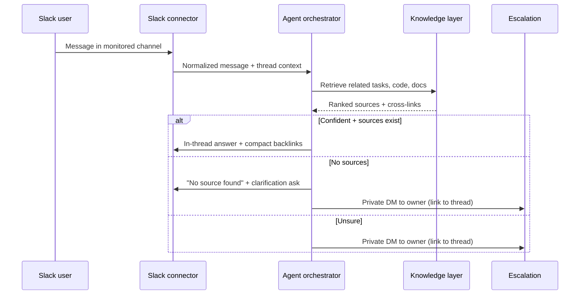
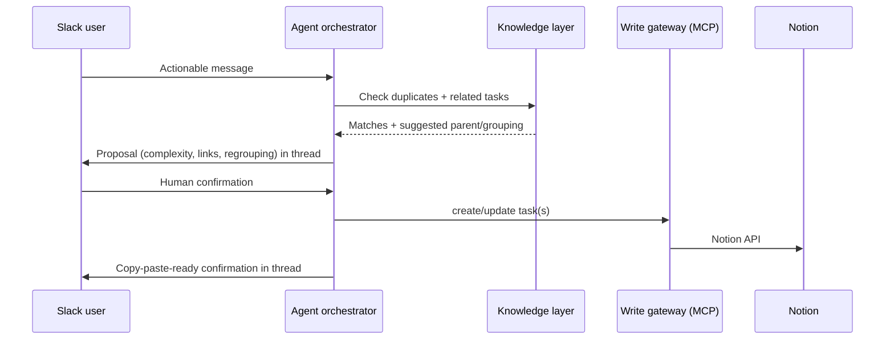
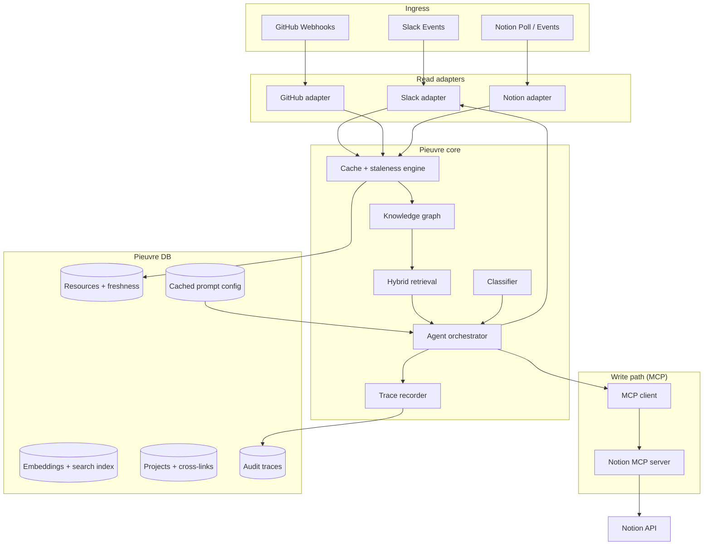

# Pieuvre

**Knowledge center for projects.** Pieuvre monitors Slack, reads GitHub and Notion, cross-links related work, answers questions with exact source citations, and proposes well-linked Notion tasks — with human confirmation before any write.

**Primary users (V0):** you and your workmates (small internal team).

**Implementation plan:** [docs/PHASES.md](docs/PHASES.md) — 7 phases (~11–12 weeks), built for seamless linking between ingest → search → answer → enrich → task.

**Domain glossary:** [CONTEXT.md](CONTEXT.md)

**Configuration:** [docs/CREDENTIALS.md](docs/CREDENTIALS.md) · [docs/NOTION.md](docs/NOTION.md) · [docs/LLM.md](docs/LLM.md)

---

## What it does

Pieuvre sits in a short list of selected Slack channels and:

1. **Monitors continuously** — reacts to actionable messages and explicit `@Pieuvre` mentions.
2. **Classifies intent** — feature, bug, support request, or information about those. Ignores announcements, casual chat, and unrelated noise. Subtypes are inferred freely (no fixed taxonomy in V0).
3. **Checks context first** — scans Pieuvre's DB for related Notion tasks, GitHub issues/PRs, code references, and prior Slack threads before replying.
4. **Clarifies in-thread** — when intent is unclear, asks the original requester in the Slack thread (not privately).
5. **Answers with sources** — replies in-thread when confident, with compact backlinks to exact Notion pages, GitHub issues/PRs/files, and Slack threads. Never fabricates sources; if none exist, says so clearly.
6. **Escalates when stuck** — asks for clarification first; if still no reliable source, privately DMs the competent person (manual mapping + GitHub/Notion ownership inference), linking back to the original thread.
7. **Proposes tasks** — after clarification, scans for duplicates and related work, may suggest parent/grouping tasks, includes complexity estimate when available, and asks for **human confirmation** before creating or updating Notion.
8. **Audits everything** — LangSmith-like traces of reasoning and actions, visible to the internal team only in V0.

**V0 north star:** cross-linking reference and assisted answers. Task editing quality is secondary; gaps can be corrected by talking to Pieuvre in text.

---

## Core workflows

### Answer a question



### Turn a Slack thread into a Notion task



---

## V0 scope

| Area | V0 behaviour |
|---|---|
| **Users** | Internal team (you + workmates) |
| **Slack** | Continuous monitoring + explicit mention. Short list of channels. Clarify in-thread. |
| **GitHub** | Read-only (status, issues, PRs, code context). No issue creation in V0. |
| **Notion** | Create and update tasks after confirmation. Complex structural ops delegated to humans. |
| **Classification** | Flexible inference; no fixed subtype taxonomy. |
| **Multi-project** | Yes — per-project skeletons + explicit cross-project links from day one. |
| **Project routing** | Message content is primary; channel provides default hint; layered prompts help disambiguate. |
| **Confidence** | Prompt-driven agent judgment first; hard-coded early returns added later from trace analysis. |
| **Freshness exposure** | Only when confidence is low or the user asks — not on every reply. |
| **Initial setup** | Manual trigger → broader scan of connected Slack, GitHub, and Notion to validate ingestion. |
| **Ongoing sync** | Event-driven updates + admin-only full rescan on request (heavily gated, costly). |
| **Storage** | Normalized extracts + source references by default; raw payload snapshots only when necessary. |
| **Traces** | LangSmith-like; internal team only in V0. |
| **Prioritization** | Deferred (weekly polls, cost/priority scoring). |

---

## Architecture overview



### Layer responsibilities

| Layer | Responsibility |
|---|---|
| **Read adapters** | Source-specific metadata probes and canonical content extraction. No business logic. |
| **Cache + staleness engine** | Unified freshness lifecycle, invalidation, revalidation, re-index triggers. |
| **Knowledge graph** | Per-project skeletons; cross-project links when evidence exists. |
| **Hybrid retrieval** | Keyword + vector search over indexed resources; returns exact source IDs for citation. |
| **Agent orchestrator** | Classification, reasoning, confidence, clarification, escalation, task proposals. |
| **MCP client** | All mutations (Notion create/update, future integrations) via literal MCP tool calls. |
| **Trace recorder** | Step-level audit: inputs, outputs, confidence, sources used, actions taken. |

---

## Design decisions

### 1. Own DB as operational source of truth

Slack, GitHub, and Notion remain decoupled from each other. Pieuvre syncs them into its own database:

- Normalized resource records with freshness metadata.
- Source IDs stored alongside knowledge for exact citation backlinks.
- Per-project skeletons and cross-project link edges.
- Derived artifacts (embeddings, summaries, snippets) as dependent cache layers.
- Audit traces and cached prompt configuration.

External systems are never queried on every user message when a fresh cached copy exists.

### 2. Read adapters + MCP write path (bridge pattern)

**Read path:** thin adapters per source implementing:

```typescript
interface SourceAdapter {
  getMetadata(resourceId: string): Promise<ResourceMetadata>;
  getCanonicalContent(resourceId: string): Promise<CanonicalContent>;
}
```

**Write path:** mutations go through **literal MCP servers** (starting with Notion). The agent calls MCP tools; it never hits Notion/Slack/GitHub write APIs directly. Read adapters stay in-process for latency.

This keeps connector code small, testable, and swappable.

### 3. Shared freshness and invalidation framework

One staleness engine for all connectors. Adapters only supply metadata and canonical content.

**Decision order:**

1. **Fresh** → serve cached result.
2. **Stale + validator** (`updated_at`, ETag, revision token) → lightweight revalidation.
3. **Stale, no validator** → fetch canonical content, compare hash.
4. **Changed** → discard cached artifact + derived index entries, re-search, re-index.
5. **Deleted / inaccessible** → mark unavailable, remove from active results.

**Canonical hash rules:** normalize whitespace, sort unordered collections, exclude transport/ephemeral fields, preserve semantic content.

**Ongoing sync:** event-driven invalidation for day-to-day freshness; admin-only full rescan when a deep rebuild is needed.

### 4. Knowledge graph: project skeleton + cross-links

- Base unit: **per-project skeleton** (tasks, code refs, docs, Slack threads).
- **Cross-project links** added only when retrieval or classification finds evidence — not a monolithic global graph on day one.
- Efficient, auditable, and scales as projects multiply.

### 5. Prompt configuration in GitHub

Project and channel instructions live as **versioned files** in the Pieuvre repo (or a dedicated config repo). Pieuvre:

1. Reads files via GitHub API.
2. Caches parsed config in its DB.
3. Invalidates cache on file change (same staleness framework).

A shared core prompt is layered with per-project and per-channel instructions. Non-technical editing via Notion UI is deferred.

### 6. Escalation and ownership

Competent-person routing uses **both**:

- Manual mapping (project/topic → person) in config.
- Inferred ownership from GitHub (`CODEOWNERS`, issue assignees) and Notion page properties.

Escalation is **private DM first**, always linking back to the original Slack thread.

### 7. Confidence model (V0 → later)

- **V0:** prompt-driven agent outputs answer + confidence rationale; reply directly when confident.
- **Later:** hard-coded early returns calibrated from trace analysis (open coding → axial coding on recorded runs).

### 8. Projects, credentials, and Notion

- Each **project** has independent Slack channels, GitHub repos, and Notion database — linked via CrossLinks, not shared globals.
- **Credential profiles** (`slack_main`, `github_org`, `notion_ws_main`) — project YAML references profiles; secrets in env only. [CREDENTIALS.md](docs/CREDENTIALS.md)
- **Notion A+:** canonical task model + per-project `field_map` + hybrid drift recovery (thread prompt → admin DM). [NOTION.md](docs/NOTION.md)
- **MCP** hosts Notion write tokens; Pieuvre read adapters use the same integration token from env.

---

## V0 stack (confirmed)

| Concern | Choice | Rationale |
|---|---|---|
| **Language** | TypeScript / Node.js | Slack + MCP SDK fit; one runtime for adapters, agent, and MCP client. |
| **Write actions** | Literal MCP tools | Isolated, auditable Notion mutations via MCP servers. |
| **LLM** | Reasoning tiers via config | Provider-agnostic; tier per step. See [LLM.md](docs/LLM.md). |
| **Deployment** | Self-hosted Docker | Full data control; docker-compose on VPS/homelab. |
| **Database** | PostgreSQL only | Data, job queue, pgvector, traces — no Redis in V0. |
| **Retrieval** | C+ phased | BM25 + graph (Phase 2); pgvector on prose only — not full repo embed. |
| **GitHub code context** | PR enrichment comments | Scan agent (Cursor/Claude Code) posts `#pieuvre-enrichment`; Pieuvre ingests. |
| **Task confirmation** | Plain text in thread | Thread FSM; agent interprets yes/no — buttons deferred. |
| **Slack ingress** | Events API + HTTP webhook | Push-based; reverse proxy terminates TLS. |
| **Tracing** | Postgres traces (Phase 0–6) | LangFuse optional post Phase 6. |
| **Credentials** | Profile indirection + `.env` V0 | Projects ref profiles; MCP holds Notion write token. See [CREDENTIALS.md](docs/CREDENTIALS.md). |
| **Notion tasks** | Per-project DB + canonical `field_map` | Schema drift: hybrid Slack prompt. See [NOTION.md](docs/NOTION.md). |
| **Embeddings** | Cloud API (Phase 2) | Provider via config; vectors in pgvector. |
| **Admin ops** | Global env list | `PIEUVRE_ADMIN_SLACK_IDS` for rescan / admin CLI. |

---

## Data model (high level)

```
Project
  ├── id, name, prompt_config_ref
  ├── channel_hints[]          # default project context
  └── skeleton
        ├── tasks[]            # Notion task refs + normalized fields
        ├── code_refs[]        # GitHub file/issue/PR refs
        ├── docs[]             # Notion page refs
        └── slack_threads[]    # thread refs + normalized extracts

CrossLink
  ├── source_resource_id
  ├── target_resource_id
  ├── link_type               # duplicate_of, related_to, parent_of, blocks
  └── evidence                # retrieval score, agent rationale, trace ref

Resource (unified cache record)
  ├── resource_id, source_type
  ├── updated_at, version_marker, content_hash
  ├── fetched_at, stale_after, status
  └── normalized_extract      # not raw payload unless required

Trace
  ├── thread_id, steps[]
  ├── confidence, sources_used[]
  └── actions_taken[]
```

---

## What is explicitly deferred

| Item | Notes |
|---|---|
| Task template (Notion DB layout) | Canonical fields defined; copy template per project when onboarding. |
| Task confirmation auth | **Per-project** `task_confirmation.allowed_roles` in YAML — see [NOTION.md](docs/NOTION.md). |
| "Too complex" operation threshold | Derive from trace analysis (open → axial coding). |
| Non-technical prompt editing | Notion UI for instructions — later. |
| Prioritization | Weekly polls, cost/priority scoring — later. |
| GitHub writes | Issue/PR creation — post-V0. |
| GitHub MCP server | Read-only in V0; write MCP deferred. |

---

## Project structure (planned)

```
pieuvre/
├── connectors/              # Read adapters: slack, github, notion
│   └── _adapter.ts          # Shared adapter interface
├── core/
│   ├── cache/               # Staleness engine + invalidation
│   ├── graph/               # Project skeletons + cross-links
│   ├── retrieval/           # Hybrid search + citation assembly
│   ├── agent/               # Orchestrator, classifier, confidence
│   └── traces/              # Audit trail recorder
├── mcp/                     # MCP client + server configs (Notion MCP, future)
├── db/                      # Schema, migrations
├── prompts/                 # Core + per-project/channel config (also in GitHub)
└── config/                  # credential-profiles.yaml, examples
```

---

## Success metrics (V0)

| Metric | Target |
|---|---|
| Cross-linking quality | Answers include relevant related tasks/sources when they materially improve context |
| Source citation | Every factual claim links to an exact Notion/GitHub/Slack source, or explicitly states none exists |
| Duplicate detection | Proposals surface existing related tasks before suggesting new ones |
| Auditability | Every agent run has a replayable trace for internal tuning |

Task creation polish, prioritization automation, and authorization hardening are explicitly secondary in V0.

---

## Implementation phases (summary)

| Phase | Focus | Milestone |
|---|---|---|
| **0** | Foundation | Docker, Postgres, queue, stable seam interfaces |
| **1** | Ingest | Slack/GitHub/Notion → `resources` table |
| **2** | Link | BM25 + pgvector + CrossLinks |
| **3** | Answer | Cited replies in Slack — **daily-usable MVP** |
| **4** | Enrich | PR comment ingest from scan agent |
| **5** | Task | Text confirm → Notion MCP |
| **6** | Harden | Full staleness, admin rescan, multi-project polish |

Full flows, schemas, and exit criteria: [docs/PHASES.md](docs/PHASES.md).
