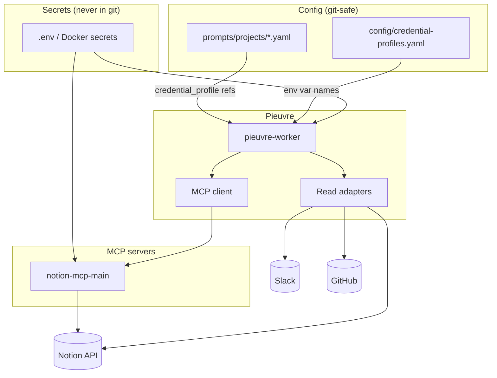

# Credentials & connection profiles

How Pieuvre authenticates to Slack, GitHub, and Notion as data sources grow — **without** putting secrets in project YAML or committing tokens to git.

See also: [NOTION.md](NOTION.md) · [PHASES.md](PHASES.md) · [CONTEXT.md](../CONTEXT.md)

---

## Principles

| Principle | Meaning |
|---|---|
| **Projects declare membership, not secrets** | YAML lists channels, repos, database IDs — never API keys |
| **Credential profiles** | Named slots (`github_org`, `notion_ws_main`) resolved at runtime |
| **One token per integration** | Adding a repo ≠ adding a secret; update project YAML + token scope |
| **MCP holds write keys** | Notion mutations via MCP server env; Pieuvre holds read keys |
| **Cross-linking is credential-agnostic** | `resource_id` + `CrossLink` edges work regardless of which profile ingested a source |

---

## Architecture



---

## Credential profiles

Defined in `config/credential-profiles.yaml` (committed). **Values** live in environment / Docker secrets only.

```yaml
# config/credential-profiles.example.yaml
profiles:
  slack_main:
    kind: slack
    env: SLACK_BOT_TOKEN
    signing_secret_env: SLACK_SIGNING_SECRET

  github_org:
    kind: github
    env: GITHUB_TOKEN
    # PAT or GitHub App installation token

  notion_ws_main:
    kind: notion
    read_env: NOTION_TOKEN
    mcp_service: notion-mcp-main
    write_env: NOTION_TOKEN
```

| Profile kind | Used by | Secret location |
|---|---|---|
| `slack` | Slack read adapter + replies | Pieuvre worker env |
| `github` | GitHub read adapter + webhooks | Pieuvre worker env |
| `notion` | Notion read adapter | Pieuvre worker env (`read_env`) |
| `notion` write | Notion MCP tools | MCP server env (`write_env`) |

**Same Notion integration token** on read adapter and write MCP is normal.

### Multiple Notion workspaces

Add a profile + MCP service per workspace — not per repo:

```yaml
profiles:
  notion_ws_main:
    kind: notion
    read_env: NOTION_TOKEN_MAIN
    mcp_service: notion-mcp-main
    write_env: NOTION_TOKEN_MAIN

  notion_ws_client:
    kind: notion
    read_env: NOTION_TOKEN_CLIENT
    mcp_service: notion-mcp-client
    write_env: NOTION_TOKEN_CLIENT
```

```yaml
# docker-compose.yml (excerpt)
services:
  notion-mcp-main:
    image: ...
    environment:
      NOTION_TOKEN: ${NOTION_TOKEN_MAIN}
  notion-mcp-client:
    image: ...
    environment:
      NOTION_TOKEN: ${NOTION_TOKEN_CLIENT}
```

---

## Per-project config

Each project references profiles and declares **which** resources belong to it.

```yaml
# prompts/projects/acme.example.yaml
project_id: acme

credential_profile:
  slack: slack_main
  github: github_org
  notion: notion_ws_main

slack_channels:
  - "#acme-dev"
  - "#acme-support"

github_repos:
  - "acme/backend"
  - "acme/web"

notion:
  task_database_id: "xxxxxxxx-xxxx-xxxx-xxxx-xxxxxxxxxxxx"
  field_map:
    title: Title
    status: Status
    priority: Priority
    assignee: Assignee
    slack_thread: Slack thread

owners:
  default: "@alice"
  notion_admin: "@alice"
  backend: "@bob"

instructions: |
  Acme project context for the agent...
```

Pieuvre resolves project from **message content** (primary) + **channel hint** (secondary), then uses that project's profiles for read/write routing. **CrossLinks** connect resources across projects regardless of profile.

---

## Secret storage lifecycle

| Stage | When | Backing store |
|---|---|---|
| **V0** | 1 workspace, 1 org, ~5–15 secrets | `.env` + Docker Compose `secrets:` |
| **Growth** | 2+ Notion workspaces, staging + prod | Same profiles; add `NOTION_TOKEN_STAGING`, etc. |
| **Migrate** | >~15 secrets, rotation, multiple admins | [SOPS](https://github.com/getsops/sops)-encrypted files or Infisical/Vault |
| **Never** | — | Raw tokens in `prompts/` or git |

**.env is the V0 implementation, not the architecture.** Profile indirection stays stable when the backing store upgrades.

### V0 `.env` template (gitignored)

```bash
# Slack
SLACK_BOT_TOKEN=xoxb-...
SLACK_SIGNING_SECRET=...

# GitHub (org PAT or app token — scoped to required repos)
GITHUB_TOKEN=ghp_...

# Notion (integration with access to task databases)
NOTION_TOKEN_MAIN=secret_...

# LLM (provider-agnostic)
LLM_PROVIDER=anthropic
ANTHROPIC_API_KEY=...

# Admin
PIEUVRE_ADMIN_SLACK_IDS=U01,U02
```

---

## Adding a new data source

### New GitHub repo (same org)

1. Ensure `GITHUB_TOKEN` has repo access.
2. Add `github_repos: ["org/new-repo"]` to project YAML.
3. Run `pieuvre scan --project acme --sources github`.
4. **No new secret.**

### New Slack channel

1. Invite bot to channel.
2. Add channel to project YAML `slack_channels`.
3. **No new secret.**

### New Notion database (same workspace)

1. Share database with Notion integration.
2. Set `notion.task_database_id` in project YAML (+ `field_map`).
3. **No new secret.**

### New connector type (e.g. Linear)

1. Add adapter or MCP server.
2. Add one profile in `credential-profiles.yaml` + one env var.
3. Reference profile from project YAML.

---

## MCP and credentials

| Path | Credentials | Why |
|---|---|---|
| **Read** (high volume) | Pieuvre worker via profiles | Latency; in-process adapters |
| **Write** (Notion) | MCP server env | Isolation; auditable tool calls |

Pieuvre MCP client selects server by project's `credential_profile.notion` → `mcp_service` name.

Future read MCP (optional): add profile with `mcp_service` for read-only tools without changing project YAML structure.

---

## Security notes

- Rotate tokens on a schedule; profiles make rotation a env swap, not YAML edit.
- `PIEUVRE_ADMIN_SLACK_IDS` gates `pieuvre rescan` and destructive admin CLI (Phase 6).
- Traces must not log raw tokens.
- PR enrichment and scan agent use developer credentials outside Pieuvre — document separately.

### Admin operations (global)

Costly operations (`pieuvre rescan`, platform-wide admin CLI) require a Slack user ID in **`PIEUVRE_ADMIN_SLACK_IDS`** (env only — not per-project config).

| Operation | Who (V0) |
|---|---|
| `pieuvre rescan` (full, dry-run gated) | Global admins only |
| `pieuvre rescan --dry-run` | Global admins only |
| `pieuvre scan --project X` (setup / re-index project) | Global admins only in V0 |
| Notion `field_map` drift fix in thread | Requester / owners (see [NOTION.md](NOTION.md)) |

Per-project admin delegation deferred unless ops burden grows.

---

## Related decisions

| Topic | Doc |
|---|---|
| Notion canonical fields + field_map + drift | [NOTION.md](NOTION.md) |
| Phased implementation | [PHASES.md](PHASES.md) |
| PR enrichment format | [PHASES.md § Phase 4](PHASES.md#phase-4--enrich) |
