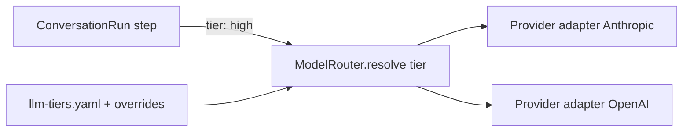

# LLM routing — reasoning tiers

Provider-agnostic model selection via **complexity tiers**, not hardcoded models in code.

---

## Idea (validated)

Map each LLM call to a **tier** (`low` → `highest`). Config binds tiers to `(provider, model)`. Steps in `ConversationRun` declare which tier they need.

**Smart because:**

- One orchestrator, multiple model grades — cost where safe, quality where it matters
- Swap providers without touching agent logic
- Override ladder: global → project → step (later)
- Traces record `{ step, tier, provider, model }` for tuning

**Avoid in V0:**

- Separate agent processes per tier (over-engineering)
- Per-step overrides before traces show need
- Running everything on `highest` (cost) or everything on `low` (bad citations)

---

## Architecture



```typescript
interface ModelRouter {
  resolve(tier: ReasoningTier, ctx?: { projectId?: string; step?: string }): Promise<LLMClient>;
}

type ReasoningTier = 'low' | 'medium' | 'high' | 'highest';
```

Single `ConversationRun` module; tiers vary **per step**, not per “agent personality.”

---

## Config (global)

```yaml
# config/llm-tiers.example.yaml

providers:
  anthropic:
    api_key_env: ANTHROPIC_API_KEY
  openai:
    api_key_env: OPENAI_API_KEY

tiers:
  low:
    provider: anthropic
    model: claude-haiku-4-20250514
  medium:
    provider: anthropic
    model: claude-sonnet-4-20250514
  high:
    provider: anthropic
    model: claude-sonnet-4-20250514
  highest:
    provider: anthropic
    model: claude-opus-4-20250514

# Default tier per ConversationRun step
step_tiers:
  classify_intent: low
  noise_filter: low
  confirm_parse: medium
  schema_drift_parse: medium
  escalation_message: medium
  answer: high
  task_proposal: high
  cross_link_rationale: medium
```

Mix providers per tier if you want (e.g. `low` on OpenAI mini, `high` on Anthropic Sonnet).

---

## Override ladder (later)

Priority (highest wins):

1. `prompts/projects/{id}.yaml` → `llm_overrides.step_tiers.answer: highest`
2. `config/llm-tiers.yaml` → `step_tiers`
3. Built-in defaults in code (fallback only)

```yaml
# prompts/projects/acme.example.yaml
llm_overrides:
  step_tiers:
    answer: highest
    task_proposal: high
```

Phase 3 ships **global config only**. Project/step overrides in Phase 6 or when traces justify it.

---

## Recommended tier assignment (V0)

| Step | Tier | Rationale |
|---|---|---|
| `classify_intent` / noise filter | **low** | Short structured output |
| `confirm_parse` / `schema_drift_parse` | **medium** | NLU but narrow schema |
| `escalation_message` | **medium** | Short, templated |
| `answer` (with citations) | **high** | North star — citation discipline |
| `task_proposal` + duplicate analysis | **high** | Structured + reasoning |
| `cross_link_rationale` | **medium** | Optional; can merge into answer |

Use **`highest` sparingly** — ambiguous multi-project threads, regrouping tasks, or explicit project override.

---

## Cost vs quality

| Pattern | Effect |
|---|---|
| All `high` | Simplest; ~2–3× cost vs tiered |
| Tiered (above) | ~30–50% LLM cost reduction with minimal quality loss on classify/confirm |
| All `low` | Cheap; unacceptable citation error rate for north star |

Embeddings stay separate ([RESEARCH.md](RESEARCH.md) — cloud API, not tiered with chat).

---

## Trace fields

Every LLM step logs:

```json
{
  "step": "answer",
  "tier": "high",
  "provider": "anthropic",
  "model": "claude-sonnet-4-20250514",
  "tokens_in": 4200,
  "tokens_out": 380,
  "latency_ms": 2100
}
```

Enables: “raise `answer` to highest for project X” from data, not guesses.

---

## Phase placement

| Phase | Deliverable |
|---|---|
| **0** | `ModelRouter` interface + stub |
| **3** | `config/llm-tiers.yaml` + provider adapters + `step_tiers` |
| **6** | Project `llm_overrides` in YAML |

---

## Related

- [PHASES.md](PHASES.md) Phase 3 — ConversationRun
- [CREDENTIALS.md](CREDENTIALS.md) — API keys in env per provider
- [CONTEXT.md](../CONTEXT.md) — Conversation run
