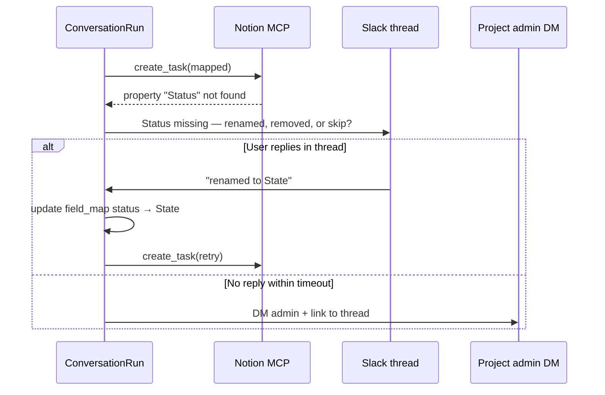

# Notion integration

Per-project Notion databases, canonical task model, field mapping, and schema drift recovery.

Credentials: [CREDENTIALS.md](CREDENTIALS.md)

---

## Model: A+ (canonical + mapping + drift recovery)

Pieuvre does **not** assume one global Notion database. Each **project** has its own `task_database_id` and optional `field_map`. Cross-linking uses `resource_id` (`notion:{page_id}`), not column names.

| Layer | Role |
|---|---|
| **Canonical task model** | Stable internal fields Pieuvre understands |
| **field_map** | Per-project YAML/DB: canonical → Notion property name |
| **Standard template** | Recommended Notion DB layout when onboarding a project |
| **Drift detector** | Before MCP write / on sync: verify mapped properties exist |
| **Migration flow** | Missing property → prompt in Slack → update map → retry |

---

## Canonical task fields (V0)

| Canonical field | Required | Notes |
|---|---|---|
| `title` | yes | Page title / Name |
| `status` | yes | Select or status property |
| `description` | no | Body or rich text |
| `priority` | no | Select |
| `assignee` | no | Person |
| `slack_thread` | yes | URL to originating Slack thread |
| `project_id` | yes | Stored in Pieuvre; may map to Notion select/relation |
| `source_resource_ids` | no | Relation or text; links to related issues/docs |

Extend canonical model in one place; per-project `field_map` translates to Notion.

```yaml
notion:
  task_database_id: "..."
  field_map:
    title: Title
    status: Status
    description: Description
    priority: Priority
    assignee: Assignee
    slack_thread: Slack thread
    project_id: Project
```

Optional: `field_map` stored in Postgres after drift edits; synced back to YAML via admin PR.

---

## Writes via MCP

1. `ConversationRun` builds canonical task payload.
2. Map to Notion properties via `field_map`.
3. MCP tool `create_task` / `update_task` on project's `notion_mcp` service.
4. On success: upsert `notion:{page_id}` Resource + CrossLinks to Slack thread / GitHub issues.

Pieuvre never calls Notion write API directly.

---

## Schema drift (hybrid C)

When a mapped Notion property is missing or renamed:



| Scenario | Where Pieuvre asks |
|---|---|
| Write blocked (task confirmation flow) | **Same Slack thread** first |
| Background sync detects drift | **DM `owners.notion_admin`** (fallback: `owners.default`) |
| No reply within timeout | **DM project admin** — default **30 minutes** (`notion.drift_prompt_timeout_minutes`) |

**Decided (V0):** 30-minute in-thread wait before admin DM on write-blocked drift. Background sync drift still DMs admin immediately (no thread context).

Every mapping change is logged in `trace_steps` with `{ field, old, new, changed_by }`.

Agent interprets natural language ("Status is now State", "removed priority") → updates `field_map`.

---

## Task confirmation authorization (config-driven)

Who may type “yes” / confirm a task proposal is **per-project config**, not hardcoded.

```yaml
# prompts/projects/{id}.yaml
task_confirmation:
  allowed_roles:
    - requester
    - project_owners
```

| Role | Meaning |
|---|---|
| `requester` | Slack user who sent the original actionable message |
| `project_owners` | Users listed in `owners.slack_ids` (or resolved from `owners.*` handles) |
| `thread_participants` | Anyone who posted in the thread (use with care) |

**Preset policies** (optional shorthand in config loader):

| Preset | `allowed_roles` |
|---|---|
| `requester_or_owners` (default) | `[requester, project_owners]` |
| `requester_only` | `[requester]` |
| `owners_only` | `[project_owners]` |
| `thread_participants` | `[thread_participants]` |

If `task_confirmation` is omitted → default **`requester_or_owners`**.

On unauthorized confirm, Pieuvre replies in-thread (no MCP write):

> Only the requester or project owners can confirm this task. See `owners` in project config.

Logged in trace: `{ event: confirmation_denied, user_id, allowed_roles }`.

---

## Read ingest (Phase 1+)

- Notion read adapter uses project's `credential_profile.notion` → `NOTION_TOKEN_*`.
- Index pages in configured databases + linked docs.
- Resources use `resource_id: notion:{page_id}`.
- Staleness: `last_edited_time` + hash fallback (Phase 6).

---

## Onboarding checklist

- [ ] Copy [Pieuvre task template](https://notion.so) (TBD) or align existing DB to canonical fields
- [ ] Share database with Notion integration
- [ ] Add `task_database_id` + `field_map` to `prompts/projects/{id}.yaml`
- [ ] Verify with `pieuvre scan --project {id} --sources notion`
- [ ] Test write in Phase 5 with confirmation flow

---

## Deferred

- Non-technical field_map editing in Notion UI
- Automatic property ID resolution (V0 uses names; switch to IDs if rename-heavy)
