# Pieuvre — phased implementation plan

Phased delivery optimized for **ROI** and **seamless linking**: each phase adds capability without rewriting prior layers. Stable seams are defined up front so later phases plug in, not replace.

**North star:** cross-linked, cited answers. Notion task writes ship after the answer loop proves value.

**Confirmed stack:** TypeScript/Node · Postgres-only (data + queue + pgvector) · self-hosted Docker · literal MCP for Notion writes · provider-agnostic LLM · text confirmation in Slack · credential profiles · per-project Notion `field_map`.

See [CONTEXT.md](../CONTEXT.md) · [CREDENTIALS.md](CREDENTIALS.md) · [NOTION.md](NOTION.md)

---

## Architecture spine (stable across all phases)

Build these interfaces in Phase 0. **Do not break them** in later phases — only add implementations.

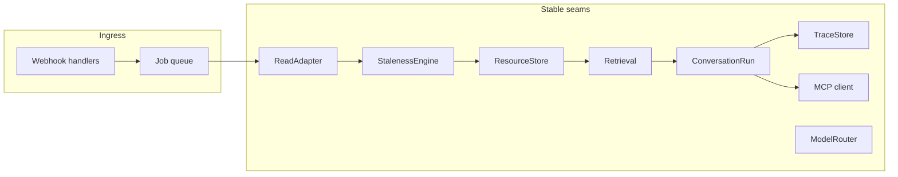

### Seam contracts (implement empty/stub in Phase 0)

```typescript
// connectors/_adapter.ts
interface ReadAdapter {
  sourceType: SourceType;
  getMetadata(id: string): Promise<ResourceMetadata>;
  getCanonicalContent(id: string): Promise<string>;
  normalize(id: string, raw?: unknown): Promise<NormalizedExtract>;
}

// core/resource/store.ts
interface ResourceStore {
  upsert(resource: Resource): Promise<void>;
  get(id: string): Promise<Resource | null>;
  markStatus(id: string, status: ResourceStatus): Promise<void>;
}

// core/cache/staleness.ts — Phase 1: TTL + updated_at; Phase 6: full hash
interface StalenessEngine {
  evaluate(id: string): Promise<'fresh' | 'revalidate' | 'invalidate'>;
  revalidate(adapter: ReadAdapter, id: string): Promise<void>;
}

// core/retrieval/search.ts — Phase 2 fills in
interface Retrieval {
  search(query: SearchQuery): Promise<RankedSource[]>;
  expandCrossLinks(sourceIds: string[], maxHops?: number): Promise<CrossLink[]>;
}

// core/agent/conversation-run.ts — Phase 3+
interface ConversationRun {
  execute(input: ThreadContext): Promise<RunResult>;
}

// core/traces/store.ts — Postgres rows; LangFuse optional later
interface TraceStore {
  startRun(threadTs: string): Promise<TraceId>;
  recordStep(traceId: TraceId, step: TraceStep): Promise<void>;
  finishRun(traceId: TraceId, summary: RunSummary): Promise<void>;
}

// core/llm/router.ts — Phase 3; stub Phase 0
interface ModelRouter {
  resolve(tier: 'low' | 'medium' | 'high' | 'highest', ctx?: { projectId?: string; step?: string }): Promise<LLMClient>;
}
```

### Resource ID scheme (linking key across phases)

| Source | `resource_id` format | Example |
|---|---|---|
| Slack thread | `slack:{team}:{channel}:{thread_ts}` | `slack:T01:C02:1234.5678` |
| GitHub issue | `github:{owner}/{repo}:issue:{n}` | `github:acme/app:issue:42` |
| GitHub PR | `github:{owner}/{repo}:pr:{n}` | `github:acme/app:pr:99` |
| Notion page | `notion:{page_id}` | `notion:abc-123` |
| PR enrichment | `github:{owner}/{repo}:pr:{n}:enrichment:{comment_id}` | ties to PR Resource |

CrossLinks always reference `resource_id`. Citations in Slack use the same IDs → seamless from Phase 2 onward.

### Postgres schema (evolve in place)

| Table | Phase introduced | Purpose |
|---|---|---|
| `resources` | 0 | Unified cache + normalized extract + freshness |
| `resource_dependencies` | 0 | Source → embedding rows (cascade invalidation) |
| `embeddings` | 2 | pgvector chunks |
| `projects` | 0 | Project skeleton + channel/repo hints |
| `cross_links` | 2 | Graph edges with evidence JSON |
| `conversation_states` | 1 | Thread FSM state per `thread_ts` |
| `jobs` | 0 | Postgres queue (pg-boss or graphile-worker) |
| `traces` / `trace_steps` | 0 | Audit (Postgres-only in V0) |
| `slack_events_seen` | 1 | Idempotency (`event_id`) |
| `project_field_maps` | 5 | Optional DB copy of Notion field_map (sync from YAML; updated on drift) |

### Credential profiles (Phase 0)

Load `config/credential-profiles.yaml` + resolve secrets from env. Project YAML references profiles only — see [CREDENTIALS.md](CREDENTIALS.md).

Phase 0 deliverables include:

- [ ] `CredentialResolver` seam: `resolve(profileName) → { token, mcpService? }`
- [ ] `.env.example` + `credential-profiles.example.yaml` (no values in git)

---

## Phase overview

| Phase | Name | Duration | User-visible outcome |
|---|---|---:|---|
| **0** | Foundation | 1–1.5 w | Docker + Postgres + queue + empty seams |
| **1** | Ingest | 2 w | Slack/GitHub/Notion → Resources in DB |
| **2** | Link | 1.5 w | Search + cross-links + citations |
| **3** | Answer | 2 w | Pieuvre answers in Slack with sources |
| **4** | Enrich | 1 w | PR scan-agent blocks → code context |
| **5** | Task | 2 w | Propose → text confirm → Notion MCP |
| **6** | Harden | 1.5 w | Staleness v2, multi-project polish, admin scan |

**Total:** ~11–12 weeks (~110–120 h) at 25 h/week.

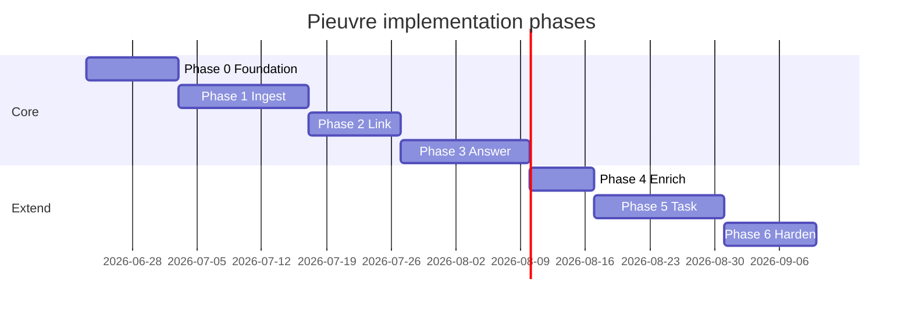

---

## Phase 0 — Foundation

**Goal:** Runnable skeleton; all seams stubbed; schema migrated.

### Deliverables

- [ ] `docker-compose.yml`: Pieuvre app + Postgres (pgvector extension)
- [ ] Migrations for all tables (empty usage OK)
- [ ] Postgres job queue wired (pg-boss recommended)
- [ ] Config loader: env + single `prompts/core.yaml` stub
- [ ] Health endpoint + structured logging
- [ ] `ReadAdapter`, `ResourceStore`, `StalenessEngine`, `Retrieval`, `ConversationRun`, `TraceStore`, `ModelRouter` — **interfaces + no-op stubs**

### Architecture note

Single codebase, two processes in compose:

| Process | Role |
|---|---|
| `pieuvre-api` | Webhooks (Slack, GitHub), health |
| `pieuvre-worker` | Job consumer: ingest, index, agent runs |

### Exit criteria

- `docker compose up` → migrations apply → enqueue test job → worker logs success
- Trace row written for test run

---

## Phase 1 — Ingest

**Goal:** External sources flow into `resources` reliably.

### Scope

| Source | What to index |
|---|---|
| Slack | Monitored channels; thread = one Resource |
| GitHub | Issues, PRs (title/body/comments), README, `/docs` — **no source files** |
| Notion | Pages in configured databases (read) |

### Flow: Slack message → Resource

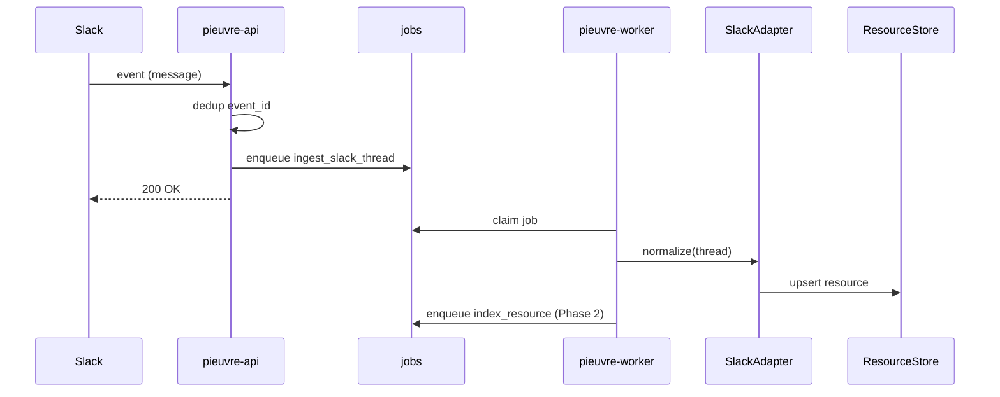

### Flow: GitHub webhook → Resource

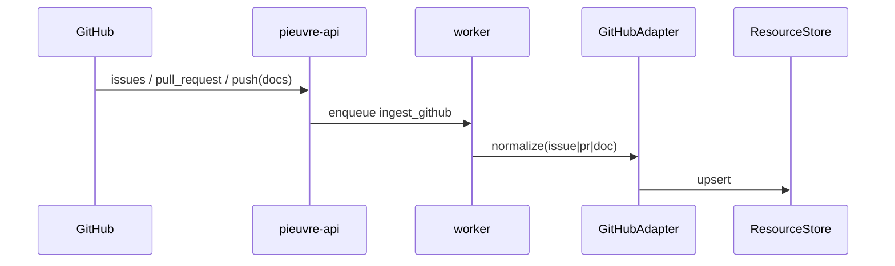

### Staleness (Phase 1 — lite)

- On ingest: set `updated_at` from source, `status = fresh`, `stale_after = now + TTL`
- TTL defaults: Slack 24h, GitHub 1h, Notion 1h
- **No hash diff yet** — Phase 6

### Thread FSM (introduced here)

```
idle | clarifying | retrieving | answering | proposing | awaiting_confirmation | executing | done
```

Phase 1 only uses: `idle` → (message received, job enqueued).

### Deliverables

- [ ] Slack Events API + signing secret + channel allowlist
- [ ] `slack_events_seen` idempotency
- [ ] GitHub webhook: issues, PRs, push on docs paths
- [ ] Notion adapter: read pages by database ID (config placeholder OK)
- [ ] `conversation_states` updated on each thread event
- [ ] CLI: `pieuvre scan --project X --sources slack,github,notion` (manual broad scan)

### Exit criteria

- Post in monitored channel → Resource row exists with normalized extract
- GitHub issue update webhook → Resource updated
- Broad scan completes with progress in `jobs` table

---

## Phase 2 — Link

**Goal:** Hybrid retrieval + CrossLinks — the linking layer everything else uses.

### Retrieval stack (C+)

1. **BM25** — Postgres `tsvector` on `normalized_extract`
2. **pgvector** — embeddings on prose Resources only:
   - `slack`, `notion`, `github_issue`, `github_pr`, `github_enrichment` (Phase 4)
   - **Exclude** raw code files
3. **RRF merge** — combine BM25 + vector ranks
4. **Graph expand** — one hop on `cross_links` from top hits
5. **Retrieval budget** — default: 10 sources, 8k tokens context, 1 re-retrieve max

### Flow: index Resource

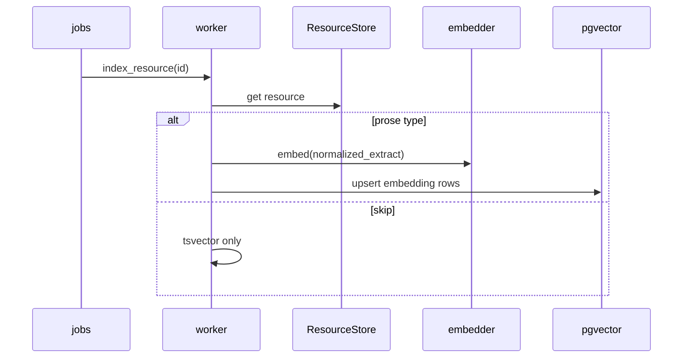

### Flow: search (used by Phase 3+)

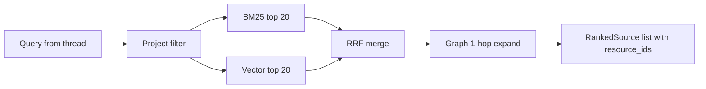

### CrossLink creation (automatic + deferred manual)

| Trigger | Link type |
|---|---|
| Retrieval RRF score high between task ↔ issue | `related_to` |
| Agent detects duplicate (Phase 5) | `duplicate_of` |
| Agent proposes parent task (Phase 5) | `parent_of` |
| Human confirmation | strengthen evidence on link |

Store `evidence: { score, trace_id, rationale }` for audit.

### Deliverables

- [ ] **Cloud embedding API** via config (`EMBEDDING_PROVIDER`, `EMBEDDING_MODEL`; default `text-embedding-3-small`)
- [ ] Chunking: one chunk per Resource in V0 (split later if needed)
- [ ] `cross_links` auto-suggest on index (related issue ↔ notion task heuristics: shared project + keyword overlap)
- [ ] `Retrieval.search()` fully implemented
- [ ] Unit tests: query → expected resource_ids

### Exit criteria

- CLI: `pieuvre search "login bug"` → ranked sources with project scope
- CrossLink rows visible between related issue and Notion task after scan

---

## Phase 3 — Answer

**Goal:** End-to-end **answer flow** in Slack — north star MVP.

### Flow: answer a question

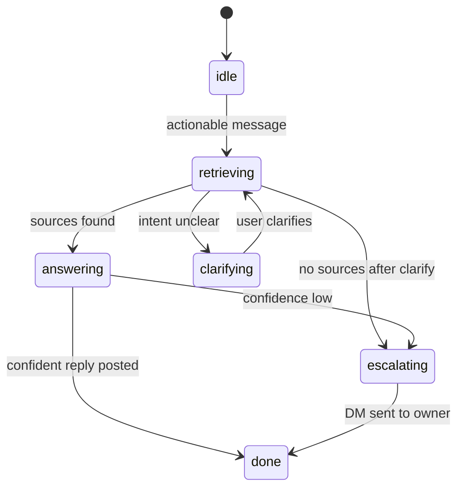

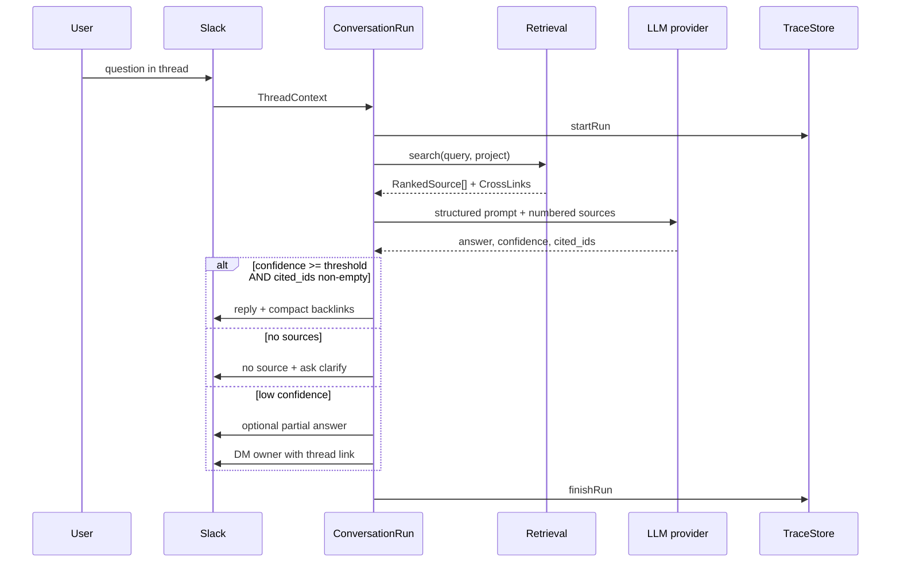

### Agent output schema (Zod)

```typescript
{
  intent: 'question' | 'task' | 'noise' | 'info';
  answer?: string;
  confidence: 'high' | 'medium' | 'low';
  cited_resource_ids: string[];
  clarification_needed?: string;
  escalation?: { owner_slack_id: string; reason: string };
}
```

### Ownership routing

Priority: manual `owners` in project YAML → GitHub CODEOWNERS → Notion assignee → project default.

### Deliverables

- [ ] `ConversationRun` orchestrator
- [ ] `ModelRouter` + `config/llm-tiers.yaml` — tier per step ([LLM.md](LLM.md))
- [ ] Provider adapters (Anthropic, OpenAI minimum)
- [ ] Noise filter (ignore announcements, casual chat)
- [ ] Project routing: content primary, channel hint secondary
- [ ] Citation formatter: compact Slack links from `resource_id`
- [ ] Private DM escalation with thread deep link
- [ ] Traces in Postgres (`traces`, `trace_steps`)
- [ ] Freshness hint in reply only when confidence low or user asks

### Exit criteria

- Ask question in Slack → answer with ≥1 valid citation or explicit "no source"
- Trace replayable from DB
- **Team can use Pieuvre daily for Q&A** ← Phase 3 milestone

---

## Phase 4 — Enrich

**Goal:** Cheap code context via scan agent + PR comments — no repo embedding.

### Enrichment format (versioned)

Scan agent posts PR comment:

```markdown
<!-- pieuvre-enrichment v1 -->
```yaml
project: acme
pr: 99
summary: Refactors auth middleware; adds session TTL.
files:
  - path: src/auth/session.ts
    change: Added refreshToken rotation
links:
  - resource_id: notion:abc-123
    relation: implements
```
```

### Flow: enrichment → Resource → CrossLink

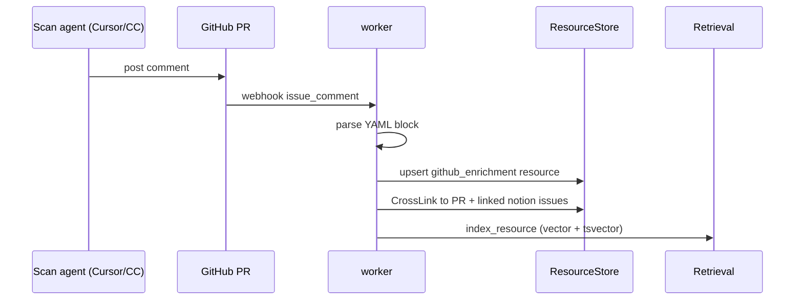

### Deliverables

- [ ] GitHub adapter: detect + parse `pieuvre-enrichment v1`
- [ ] Link enrichment Resource to PR Resource (`related_to`)
- [ ] Apply explicit `links[]` from YAML as CrossLinks
- [ ] Doc: scan agent prompt template for teammates
- [ ] Optional: Cursor rule / Claude Code skill to generate block

### Exit criteria

- Post enrichment comment on PR → searchable via `pieuvre search`
- Answer flow cites enrichment when answering "what changed in PR 99?"

---

## Phase 5 — Task

**Goal:** Task proposal → **text confirmation** → Notion MCP write.

### Flow: task creation

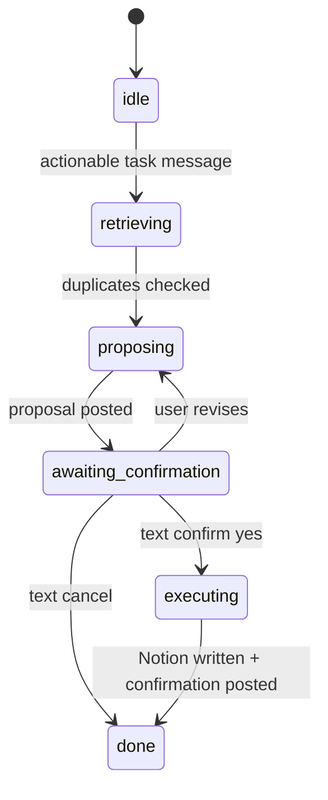

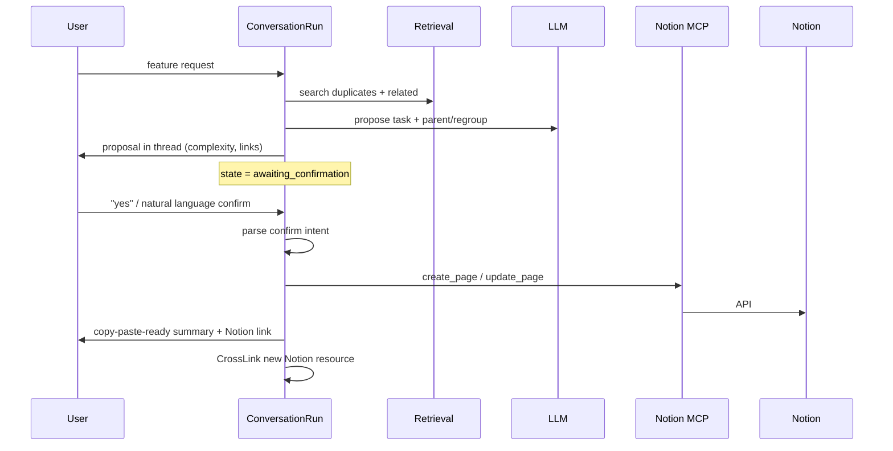

### Text confirmation rules

- Confirm/cancel authorization: **`task_confirmation.allowed_roles` in project YAML** ([NOTION.md](NOTION.md)); default `requester` + `project_owners`
- Accepted affirmations: agent interprets via structured output — not regex-only
- On ambiguous reply: ask once, stay in `awaiting_confirmation`
- **Outbox:** if MCP succeeds but Slack post fails → `pending_slack_notify` job + idempotent Notion link in DB

### Notion write (A+)

- Map canonical task → Notion via project `field_map` ([NOTION.md](NOTION.md))
- On MCP property-not-found: hybrid drift flow (thread prompt → admin DM timeout)
- MCP server selected by project's `credential_profile.notion` → `mcp_service`

### Deliverables

- [ ] Task proposal prompt + duplicate surfacing
- [ ] Thread FSM gates for confirmation
- [ ] Notion MCP server in docker-compose (stdio), one service per workspace profile
- [ ] MCP tools: `create_task`, `update_task` (canonical in, mapped properties out)
- [ ] Schema drift handler + `field_map` persistence
- [ ] CrossLink new task to Slack thread + related issues
- [ ] Complex ops (merge, reparent) → delegate message to human

### Exit criteria

- End-to-end: Slack request → confirm "yes" → Notion page exists → links in reply
- Duplicate related task shown in proposal when one exists

---

## Phase 6 — Harden

**Goal:** Production-ish self-hosted ops without re-architecting.

### Staleness v2

Upgrade StalenessEngine:

1. `updated_at` / ETag revalidation
2. Hash diff fallback (canonical content)
3. Cascade invalidation → embeddings
4. GitHub push webhook → invalidate doc Resources only

### Multi-project polish

- `prompts/projects/*.yaml` — channel hints, owners, Notion DB IDs
- GitHub webhook on `prompts/**` → invalidate config cache
- Project disambiguation question in-thread when scores tie

### Admin tools

- `pieuvre rescan --dry-run` → cost estimate → confirm
- Admin auth via **`PIEUVRE_ADMIN_SLACK_IDS`** (global env list — no per-project admin in V0)
- Metrics: queue depth, retrieval latency, `no_source` rate

### Deliverables

- [ ] Full staleness decision tree (README spec)
- [ ] Admin-gated rescan
- [ ] `.pieuvreignore` for GitHub doc paths
- [ ] Runbook: backup Postgres, rotate tokens

### Exit criteria

- Stale Notion page edit → re-index within TTL/webhook
- Full rescan dry-run shows estimate before run

---

## Flow summary matrix

| Flow | Phases active | Primary modules |
|---|---|---|
| Slack ingest | 1+ | SlackAdapter, jobs, ResourceStore |
| GitHub ingest | 1+ | GitHubAdapter, webhooks |
| Notion read ingest | 1+ | NotionAdapter |
| Index + embed | 2+ | worker, pgvector, embedder |
| Search + cross-link | 2+ | Retrieval, cross_links |
| Answer question | 3+ | ConversationRun, LLM, TraceStore |
| PR enrichment | 4+ | GitHubAdapter parser, CrossLink |
| Task propose + confirm | 5+ | ConversationRun FSM, MCP |
| Notion write | 5+ | MCP client |
| Staleness v2 | 6 | StalenessEngine |
| Admin rescan | 1 CLI, 6 gated | CLI, jobs |

---

## Seamless linking checklist

Design choices that prevent rework between phases:

| Decision | Why it links cleanly |
|---|---|
| Universal `resource_id` | Citations, CrossLinks, traces, MCP callbacks all use same key |
| Resources before agent | Phase 3 never talks to GitHub/Notion directly for reads |
| Retrieval before task flow | Phase 5 reuses same search for duplicate detection |
| CrossLinks before Notion write | New tasks link to thread/issue on create, not bolted on later |
| Thread FSM in Phase 1 | Phase 5 adds states; doesn't replace state machine |
| Traces from Phase 0 stub | Every phase adds steps; same table |
| Enrichment as Resource type | Phase 4 indexes through Phase 2 pipeline unchanged |
| Postgres-only queue | Ingest and index jobs same infrastructure from Phase 1 |

---

## Maintenance budget by phase

| After phase | Est. hours/month |
|---|---|
| Phase 3 (answer MVP) | 8–12 (prompt tuning) |
| Phase 5 (full loop) | 10–15 |
| Phase 6 (hardened) | 8–12 (ops stable, tuning decreases) |

---

## Deferred (post Phase 6)

- LangFuse (optional upgrade from Postgres traces)
- GitHub write MCP
- Non-technical prompt editing in Notion
- Weekly priority polls
- Authorization matrix for task confirmation
- Full-repo code embedding (if enrichment insufficient)

---

## Next action

Start **Phase 0**: repo scaffold + docker-compose + migrations + seam interfaces.

When Notion workspace is chosen, fill `prompts/projects/*.yaml` before Phase 1 Notion ingest and before Phase 5 MCP writes.
